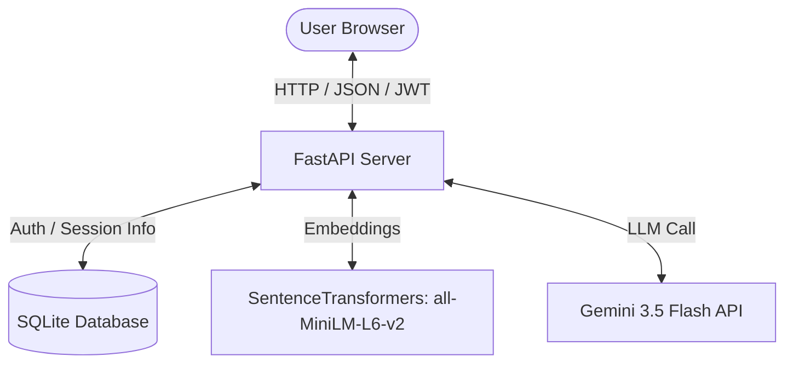

# TrueAiLab_assesment
Production-Grade GenAI RAG Assistant
# GenAI RAG Chat Assistant

A production-grade, GenAI-powered Retrieval-Augmented Generation (RAG) chat assistant. It features user authentication, a persistent SQLite vector/session database, and a clean, minimal user interface designed for project submissions.

---

## 1. System Architecture

The application is structured into decoupled backend services (FastAPI) and a single-page static frontend, communicating via JSON payloads secured with JWT bearer tokens.



RAG Sequence diagram


A. Document Chunking & Parsing
Initial Knowledge Base: Configured with 8 structured corporate documents in docs.json (covering Password resets, Wi-Fi credentials, refund policies, remote work, etc.).
Chunking Logic: Implemented an overlapping sliding window word-based chunker. It splits documents into chunks of 250 words with an overlap of 50 words (~300-350 tokens per chunk). The overlap ensures semantic concepts aren't severed at boundaries.
B. Embedding Strategy
Model: Local sentence-transformers/all-MiniLM-L6-v2 generating 384-dimensional dense vectors.
Rationale: Generates high-quality semantic representations locally without network latency, API costs, or dependency on external API keys.
C. Similarity Search & Grounding Guard
Metric: Cosine Similarity.
Formula: Cosine Similarity= 
∥A∥∥B∥
A⋅B
​
 
Threshold: Calibrated at 0.35. If the highest similarity score falls below this, retrieval is aborted and the system returns a safe grounding fallback message: "I could not find enough information in the knowledge base to answer this question."
Result: Hallucinations are actively blocked because the LLM is never called for out-of-scope questions.
D. Prompt Design & Grounding constraints
The final prompt structure strictly binds the model:

You are a helpful assistant.

Use ONLY the provided context to answer the user's question. If the context does not contain the answer, reply stating you don't have enough information. Do not use external facts.

Context:
[Source 1] Document: Guest Wi-Fi Access Code
Content: The StellarTech Guest Wi-Fi SSID is 'Stellar-Guest' and the password is 'StellarConnect2026!'...

Conversation History:
User: How do I connect to guest Wi-Fi?
Assistant: Connect to the SSID 'Stellar-Guest' using password 'StellarConnect2026!'.

Question:
Is it restricted?

3. Implementation Features
JWT Authentication (Bonus): Endpoints require valid Bearer tokens. Passwords are encrypted using bcrypt and signed JWTs are generated via PyJWT (HS256).
Persistent Storage (Bonus): Implements SQLite storing users, raw documents, chunk strings, float embedding arrays (JSON serialized), and chat history.
Multi-Document Retrieval (Bonus): Answering queries synthesizes information retrieved across multiple matching documents in the SQLite vector database.
Dynamic Model Resolver: Resolves the Gemini model name dynamically on startup based on your key's capabilities, mapping directly to gemini-3.5-flash or gemini-2.0-flash.

4. Setup & Running Instructions
Prerequisites
Python 3.10+
Internet connection (for installing requirements and querying the Gemini API)
1. Installation
Clone the repository and install the dependencies:

# Create and activate virtual environment
python -m venv .venv
.\.venv\Scripts\activate  # Windows
source .venv/bin/activate  # macOS/Linux

# Upgrade pip and install packages
python -m pip install --upgrade pip
pip install -r requirements.txt

2. Configure Environment Variables
Copy .env.example to .env and fill in your Gemini API key:

env
```
LLM_PROVIDER=gemini
GEMINI_API_KEY=your_actual_gemini_api_key_here
EMBEDDING_PROVIDER=local
SIMILARITY_THRESHOLD=0.35
TOP_K=3
JWT_SECRET=stellar_tech_jwt_secret_key_1234567890
DATABASE_URL=sqlite:///./rag_assistant.db
```
. Start the Server
Run the FastAPI application locally:

bash
```
uvicorn app.main:app --host 127.0.0.1 --port 8000
```
4. How to Test
Click "Quick Guest Start" to automatically register, sign a JWT, and log in.
Try asking in-scope queries:
"How can I reset my password?"
"What is the SSID and password for guest Wi-Fi?"
Verify that the RAG Diagnostics section updates at the bottom with token counts and cosine similarity values.
Try asking an out-of-scope query:
"Who is the president of France?"
Confirm it triggers the grounding guard fallback and logs a similarity score below the threshold.
